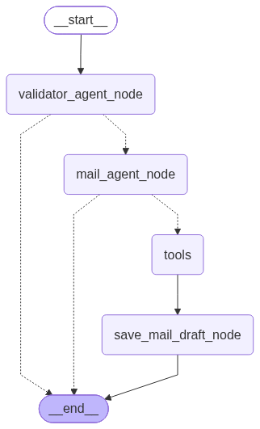

# Email Generator Agent

An AI-powered email drafting system built with Python, LangGraph, and a Model Context Protocol (MCP) service for generating email content. The project combines an langgraph workflow with a dedicated MCP server for mail generation tools.

## Overview

This project is designed to:

- accept user input such as sender mail, receiver mail, tone, and data points, additional description.
- validate whether the input is suitable for email generation
- call an AI agent to draft an email
- call the mcp server for required tools
- return a structured email draft with subject and body content

## Project Structure

```text
email_generator_app/
├── README.md
├── app_host/
├── backend/
│   ├── agent_server/
│   │   ├── azure.yaml
│   │   ├── Dockerfile
│   │   ├── pyproject.toml
│   │   └── src/
│   │       └── agent_server/
│   └── mail_mcp_app/
│       └── mail_mcp/
│           ├── pyproject.toml
│           └── src/
│               └── mail_mcp/
```

## Architecture

### 1. Langgraph Workflow



### 2. Agent Server
Location: `backend/agent_server`

This service contains the orchestration workflow and API host.

Key responsibilities:
- validate incoming email-generation requests
- route valid requests to the mail generation workflow
- coordinate model/tool calls
- expose an invocation endpoint for hosted agent interaction

Main folders:
- `src/agent_server/agent/` — workflow graph, nodes, tools, and agent logic
- `src/agent_server/server/` — invocation server entry point

### 3. Mail MCP Service
Location: `backend/mail_mcp_app/mail_mcp`

This service exposes mail-generation capabilities through MCP.

Key responsibilities:
- generate email content based on tone and data points
- run as a streamable HTTP MCP server

Main folders:
- `src/mail_mcp/tools/` — email generation tool implementations
- `src/mail_mcp/agents/` — AI agent used to produce email
- `src/mail_mcp/models/` — request/response schemas

## Workflow

The email generation flow is:

1. A request is received by the agent server
2. The validation node checks the request input
3. If valid, the mail agent continues the workflow
4. The agent invokes the MCP-based mail tool
5. The generated email is saved into the final output state
6. The application returns a structured draft with subject and body

## Tech Stack

- Python 3.14+
- LangGraph
- LangChain
- Azure OpenAI
- MCP (Model Context Protocol)
- Pydantic Settings
- FastMCP

## Prerequisites

Before running the project, make sure you have:

- Python 3.14 or newer
- `uv` installed
- access to Azure OpenAI or equivalent LLM endpoint
- a configured environment file with the required secrets

## Environment Configuration

Create a `.env` file inside `backend/agent_server` with the following values:

```env
AZURE_OPENAI_API_KEY=your_azure_openai_key
AZURE_OPENAI_ENDPOINT=https://your-resource-name.openai.azure.com
MAIL_MCP_SERVER_URL=http://localhost:8000/mcp
```

These values are loaded by the settings class in `backend/agent_server/src/agent_server/config.py`.

## Local Setup

### 1. Install dependencies

From the project root:

```bash
cd backend/agent_server
uv sync
```

Then for the MCP service:

```bash
cd ../mail_mcp_app/mail_mcp
uv sync
```

### 2. Start the MCP server

```bash
cd backend/mail_mcp_app/mail_mcp
uv run mail-mcp
```

This starts the mail MCP HTTP server on port `8000` by default.

### 3. Start the agent server

```bash
cd backend/agent_server
uv run agent-server
```

The agent server exposes the invocation handler and runs the workflow.

## Example Request

A typical payload passed to the agent invocation endpoint may include:

```json
{
  "message": "Write a professional email to my manager",
  "sender_mail": "nishant@gmail.com",
  "receiver_mail": "nish@gmail.com",
  "data_points": "Sales decreased by 10% this quarter; manager name is John Lee",
  "email_tone": "professional"
}
```

The agent returns a draft email payload similar to:

```json
{
  "drafted_mail": {
    "subject": "Quarterly Sales Performance Update",
    "body_content": "Dear John, ..."
  }
}
```

## Python code for agent invocation

```python
import os

import requests
from azure.identity import DefaultAzureCredential

endpoint = os.environ.get("FOUNDRY_PROJECT_ENDPOINT", "<PROJECT_ENDPOINT>")
agent_name = "<AGENT_NAME>"

credential = DefaultAzureCredential()
token = credential.get_token("https://ai.azure.com/.default").token

url = f"{endpoint}/agents/{agent_name}/endpoint/protocols/invocations"

response = requests.post(
    url,
    headers={
        "Authorization": f"Bearer {token}",
        "Content-Type": "application/json",
    },
    params={"api-version": "2025-05-15-preview"},
    json={
        "message": "Write a professional email to my manager",
        "sender_mail": "nishant@gmail.com",
        "receiver_mail": "nish@gmail.com",
        "data_points": "Sales decreased by 10% this quarter; manager name is John Lee",
        "email_tone": "professional",
    },
)

# Handle the response based on the API contract:
# - For non-streaming responses: use response.json()
# - For streaming responses: use response.iter_lines()
print(response.json())
```